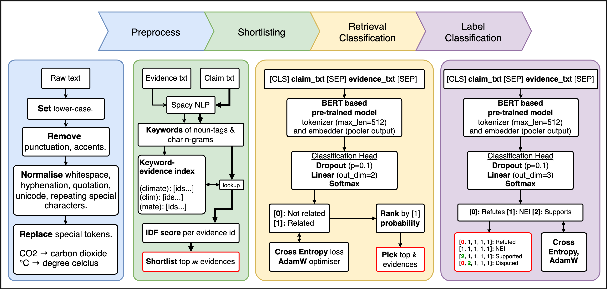

# Automated Fact Checking For Climate Science Claims

Johnson Zhou (Student ID: 1302442)

Project under COMP90042 Natural Language Processing at the University of Melbourne. Semester 1, 2023. Please refer to the project [requirements][proj_req].

## Dependencies

This project was conducted on an Apple MacBook Pro with M2 processor. The included `environment.yml` provides the basic operating environment for **Apple Silicon** devices. The default python version is **3.8**. For `pytorch` models, usage of the Metal Performance Shader (`mps`) device is preferred and selected where available.

```shell
# Initialise environment (comp90042_project)
conda env create -f ./environment.yml
```

### Additional dependencies: spaCy

The following dependencies were installed for `spacy` functionality. The `en_core_web_sm` pipeline is used due to better efficiency.

```shell
pip install -U pip setuptools wheel
python -m spacy download en_core_web_sm
```

### Output directory

Please create a directory named `result` within the base directory for data within intermediate steps to be saved.

## Final Implementation

Overview of the model design in the final implementation are as follows:




### Preprocessing

Implementation of the preprocessing pipeline can be found in [./src/normalize.py](./src/normalize.py). This is no explicit need to call preprocessing as this will be called within the various stages as needed.

### Stage 1: Shortlisting

Final implementation (with IDF):
- [Model 02c: Fast Shortlisting](./04_model/model_02c_fast_shortlisting.ipynb) to create shortlists.

Comparison implementation (without IDF):
- [Model 02a: Fast Shortlisting](./04_model/model_02a_fast_shortlisting.ipynb)

### Stage 2: Retrieval classification

Final implementation (BERT-base):
- To train: [Model 05: Bert Cross Encoder Retrieval Classifier](./04_model/model_05_bert_cross_encoder_retrieval_classifier.ipynb).
- To predict: [Infer 05: Bert Cross Encoder Retrieval Classifier](./05_inference/infer_05_bert_cross_encoder_retrieval_classifier.ipynb).

Comparison implementation (RoBERTa-MNLI):
- To train: [Model 05a: RoBERTa MNLI Cross Encoder Retrieval Classifier](./04_model/model_05a_roberta_mnli_cross_encoder_retrieval_classifier.ipynb).
- To predict: [Infer 05: Bert Cross Encoder Retrieval Classifier](./05_inference/infer_05_bert_cross_encoder_retrieval_classifier.ipynb).

### Stage 3: Label classification

Final implementation (BERT-base):
- To train: [Model 06: Bert Cross Encoder Classification](./04_model/model_06_bert_cross_encoder_classification.ipynb).
- To predict: [Infer 06: Bert Cross Encoder Classification](./05_inference/infer_06_bert_cross_encoder_label_classifier.ipynb).

Comparison implementation (RoBERTa-MNLI):
- To train: [Model 06a: RoBERTa MNLI Cross Encoder Classification](./04_model/model_06a_roberta_mnli_cross_encoder_classification.ipynb).
- To predict: [Infer 06: Bert Cross Encoder Classification](./05_inference/infer_06_bert_cross_encoder_label_classifier.ipynb).


[proj_req]: ./doc/project.pdf